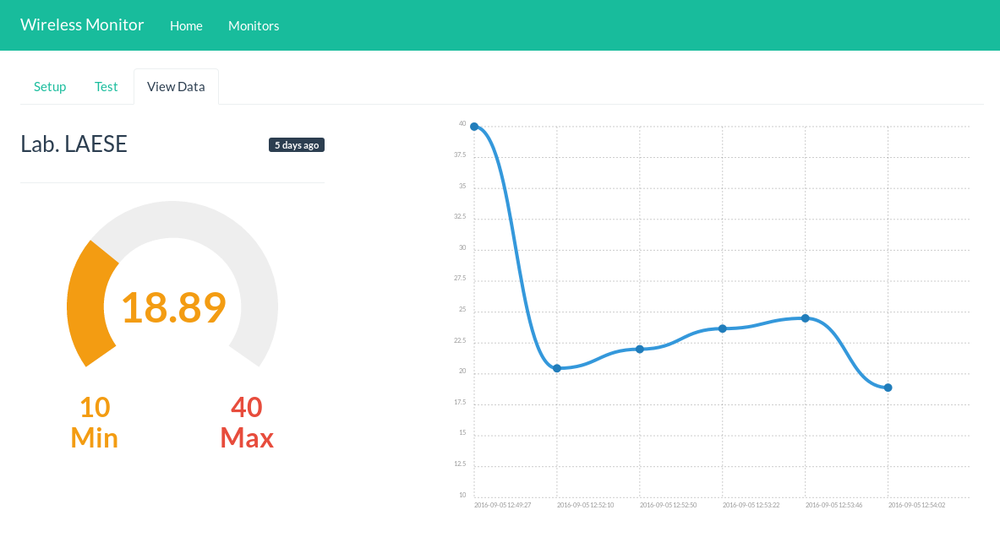

title: Internet of Things (IoT)

---

title: Wireless Monitor

Aplicativo web para receber e mostrar dados vindos de equipamentos IoT

---

title: Arquitetura

---

title: Metodologia

	
	
    
    

---

title: Revisão Teórica

Aplicativo       |  Ambiente do Servidor |  Suporte a plugins |  SDK
---------------- | --------------------- | ------------------ | ----------
Kaa              |  Java                 |    Sim             |   Sim
macchina.io      |  C++/NodeJS           |    Sim             |   Sim
SiteWhere        |  Java                 |    Sim             |   Sim
ThingSpeak       |  Ruby                 |    Sim             |   Sim
Wireless Monitor |  PHP                  |    Sim             |   Sim

---

title: Wireless Monitor - Create Temperature Monitor

<iframe width="560" height="315" src="https://www.youtube.com/embed/iTczyDZeSWk?rel=0" frameborder="0" allowfullscreen style="width: 90%"></iframe>

---

title: Wireless Monitor - Test Send Data

<iframe width="560" height="315" src="https://www.youtube.com/embed/Fo9e7soNsLE?rel=0" frameborder="0" allowfullscreen style="width: 90%"></iframe>

---

title: Processo de Autenticação

---

title: Wireless Monitor - Using JavaScript SDK

<iframe width="560" height="315" src="https://www.youtube.com/embed/UgcgAXTp-9c?rel=0" frameborder="0" allowfullscreen style="width: 90%"></iframe>

---

title: Experimento 1
class: segue nobackground fill
image: img/montagem.jpg

---

title: Experimento 1

Hardware:

* Raspberry Pi
* Arduino
* LM35 (Sensor de Temperatura)

Software:

* NodeJS
* Johnny-Five
* Wireless Monitor SDK

<https://github.com/atilacamurca/wm-sensor-temperature>

---

title: Experimento 2
class: segue nobackground fill
image: img/nodemcu-esp8266-lm35.jpg

---

title: Experimento 2

Hardware:

* NodeMcu ESP8266
* LM35 (Sensor de Temperatura)

Software:

* C/C++
* Compilado com interface Arduino IDE

<https://github.com/atilacamurca/wm-example-esp8266>

---

title: O Projeto e suas características

	
	
    
    
    
    
    
    
    
    
    
    
    
    

