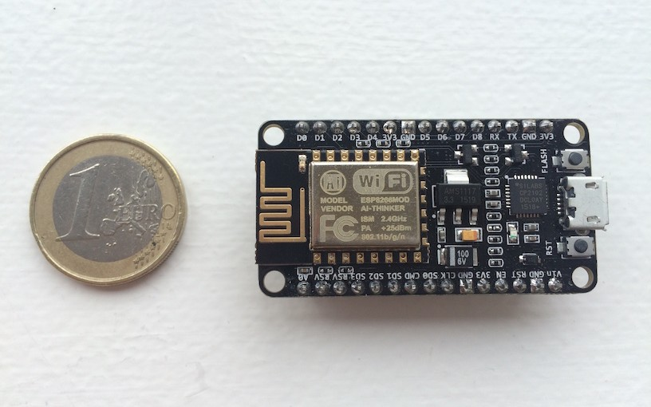
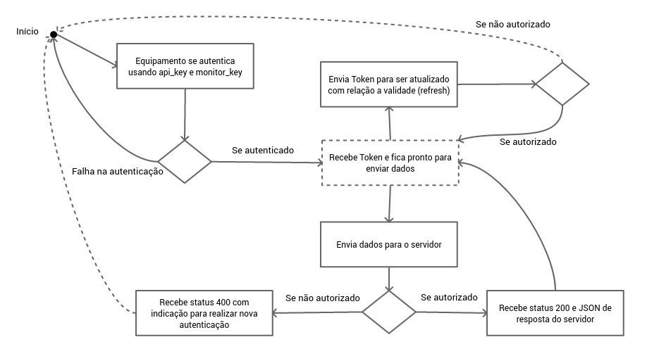

title: Sumário

* O que é IoT?
* Apresentação da ferramenta
* Arquitetura
* Metodologia
* Revisão Teórica
* Experimentos
* Conclusão
* Referências

---

title: Internet of Things (IoT)

---

title: Wireless Monitor

Aplicativo web para receber e mostrar dados vindos de equipamentos IoT

---

title: Objetivos

Oferecer uma API simples para Autenticação e Envio de dados.

* `/api/authenticate`
* `/api/send`
* `/api/refresh-token`

Permitir uma forma de autenticação _stateless_ usando JWT.

Distribuído sob licença GPL para poder ser utilizada para diversos fins.

<https://github.com/SanUSB-grupo/wireless-monitor/>

---

title: Arquitetura

---

title: Metodologia

<h3>Backend</h3>

	
	

---

title: Metodologia

	

    	<h3>Frontend</h3>
    	
    

    

    	<h3>Comunicação</h3>
        
    

---

title: Revisão Teórica

Aplicativo       |  Ambiente do Servidor |  Suporte a plugins |  SDK
---------------- | --------------------- | ------------------ | ----------
Kaa              |  Java                 |    Sim             |   Sim
macchina.io      |  C++/NodeJS           |    Sim             |   Sim
SiteWhere        |  Java                 |    Sim             |   Sim
ThingSpeak       |  Ruby                 |    Sim             |   Sim
Wireless Monitor |  PHP                  |    Sim             |   Sim

---

title: Create Temperature Monitor

	<iframe width="560" height="315"
    src="https://www.youtube.com/embed/iTczyDZeSWk?rel=0"
    frameborder="0" allowfullscreen></iframe>

Ferramenta para criação do vídeo:

<https://github.com/open-fidias/demokit/tree/fluent-ffmpeg>

---

title: Test Send Data

	<iframe width="560" height="315"
    src="https://www.youtube.com/embed/Fo9e7soNsLE?rel=0"
    frameborder="0" allowfullscreen></iframe>

---

title: Processo de Autenticação

---

title: Using JavaScript SDK

	<iframe width="560" height="315"
    src="https://www.youtube.com/embed/UgcgAXTp-9c?rel=0"
    frameborder="0" allowfullscreen></iframe>

---

title: Fluxograma funcionamento

---

title: Experimento 1
class: segue nobackground fill
image: img/montagem.jpg

---

title: Experimento 1

Hardware:

* Raspberry Pi
* Arduino
* LM35 (Sensor de Temperatura)

Software:

* NodeJS
* Johnny-Five
* Wireless Monitor SDK

<https://github.com/atilacamurca/wm-sensor-temperature>

---

title: Experimento 2
class: segue nobackground fill
image: img/nodemcu-esp8266-lm35.jpg

---

title: Experimento 2

Hardware:

* NodeMcu ESP8266
* LM35 (Sensor de Temperatura)

Software:

* C/C++
* Compilado com interface Arduino IDE

<https://github.com/atilacamurca/wm-example-esp8266>

---

title: O Projeto e suas características

	
	
    
    
    
    
    
    
    
    
    
    
    
    

---

title: Links

* Projeto: <https://github.com/SanUSB-grupo/wireless-monitor>
* Documentação: <https://sanusb-grupo.github.io/wireless-monitor/>
* SDK NodeJS/Javascript: <https://github.com/SanUSB-grupo/wm-sdk-js>
* Artigo: <https://github.com/atilacamurca/wireless-monitor-paper/tree/tcc>
* Exemplo ESP8266: <https://github.com/atilacamurca/wm-example-esp8266>
* Exemplo Raspberry Pi/Arduino: <https://github.com/atilacamurca/wm-sensor-temperature>
* Esta apresentação: <https://sanusb-grupo.github.io/wireless-monitor-press>

---

title: Publicação de Artigo

Alves, Á. C.; Jucá, S. C. S. . **Wireless Monitor - Aplicativo web livre para receber e mostrar dados vindos de equipamentos IoT**. In: ERIPI 2017 (Escola Regional de Informática do Piauí), Picos-PI.

<http://www.eripi.com.br/2017/images/certificados/eripi-certificados-artigos.pdf>

---

title: Referências

* Alves, Á. C. Sensor de temperatura usando plataforma IoT Wireless Monitor. https://github.com/atilacamurca/wm-sensor-temperature. [On-line; accessed 23-September-2016].
* Alves, Á. C. Wireless Monitor - Aplicativo web para receber e mostrar dados vindos de equipamentos IoT. https://github.com/SanUSB-grupo/wireless-monitor. [Online; accessed 03-July-2017].
* Alves, Á. C. Demokit - app for building product demos and tutorials using web technologies with GNU/Linux support (Fork). https://github.com/open-fidias/demokit. [Online; accessed 04-July-2017].
* Alves, Á. C. JavaScript SDK for Wireless Monitor. https://github.com/SanUSB-grupo/wm-sdk-js. [Online; accessed 03-July-2017].

---

title: Referências

* Alves, Á. C. wm-example-esp8266 - Example using ESP8266 to send data to Wireless Monitor. https://github.com/atilacamurca/wm-example-esp8266. [Online; accessed 04-July-2017].
* Arduino (2016). Getting Started - Introduction. https://www.arduino.cc/en/Guide/Introduction. [Online; accessed 27-September-2016].
* Atwood, M., Balfanz, D., Bounds, D., Conlan, R. M., Cook, B., Culver, L., de Medeiros, B., Eaton, B., Elliott-McCrea, K., Halff, L., Hammer, E., Laurie, B., Messina, C., Panzer, J., Quigley, S., Recordon, D., Sandler, E., Sergent, J., Sieling, T., Slesinsky, B., and Smith, A. (2012). The OAuth 2.0 Authorization Framework. https://tools.ietf.org/html/rfc6749. [Online; accessed 23-September-2016].

---

title: Referências

* Bergmann, S. (2001). PHPUnit - The PHP Testing Framework. https://phpunit.de/. [Online; accessed 04-July-2017].
* Browsersync (2017). Browsersync - Time-saving synchronised browser testing. https://browsersync.io/. [Online; accessed 04-July-2017].
* Cloud, I. (2015). What is cloud computing? https://www.ibm.com/cloud-computing/what-is-cloud-computing. [Online; accessed 27-September-2016].
* Crockford, D. (2015). JSON. https://github.com/douglascrockford/JSON-js/blob/master/README. [Online; accessed 13-September-2016].
* Demokit (2017). Demokit - app for building product demos and tutorials using web technologies. https://github.com/runkitdev/demokit/. [Online; accessed 04-July-2017].

---

title: Referências

* fluent ffmpeg (2017). A fluent API to FFMPEG. https://github.com/fluent-ffmpeg/node-fluent-ffmpeg. [Online; accessed 04-July-2017].
* Gitbook (2017). Gitbook - Documentation made easy. https://www.gitbook.com/. [Online; accessed 04-July-2017].
* GitHub (2017). GitHub Help - About pull requests. https://help.github.com/articles/about-pull-requests/. [Online; accessed 04-July-2017].
* Grokhotkov, I. (2017). ESP8266 core for Arduino. https://github.com/esp8266/Arduino/. [Online; accessed 04-July-2017].
* Gulp (2017). Gulp - Automate and enhance your workflow. http://gulpjs.com/.[Online; accessed 04-July-2017].

---

title: Referências

* Hughes-Croucher, T. and Wilson, M. (2012). Node: Up and Running. http://chimera.labs.oreilly.com/books/1234000001808/index.html. [Online; accessed 21-September-2016].
* Hugo Krawczyk, M. B. and Canetti, R. (1997). HMAC: Keyed-Hashing for Message Authentication. https://tools.ietf.org/html/rfc2104. [Online; accessed 13-September-2016].
* Instruments, T. (2016). LM35 Precision Centigrade Temperature Sensors. http://www.ti.com/lit/ds/symlink/lm35.pdf. [Online; accessed 20-September-2016].
* Jonsson, J. and Kaliski, B. (2003). Public-Key Cryptography Standards (PKCS) 1: RSA Cryptography Specifications Version 2.1. https://tools.ietf.org/html/rfc3447. [Online; accessed 13-September-2016].

---

title: Referências

* JWT (2016). Introduction to JSON Web Tokens. https://jwt.io/introduction/. [Online; accessed 13-September-2016].
* Kaa (2014). Dev center - Complete application. http://www.kaaproject.org/platform/#complete-application. [Online; accessed 13-September-2016].
* Laravel (2016). Package Development. https://laravel.com/docs/5.2/packages. [Online; accessed 13-September-2016].
* Laravel (2017a). Eloquent: Getting Started. https://laravel.com/docs/5.2/eloquent. [Online; accessed 04-July-2017].
* Laravel (2017b). Laravel Elixir. https://laravel.com/docs/5.2/elixir. [Online; accessed 04-July-2017].

---

title: Referências

* Macchina.io (2016). Bundles Overview. http://macchina.io/docs/00200-OSPBundles.html. [Online; accessed 13-September-2016].
* Michael B. Jones, J. B. and Sakimura, N. (2015). JSON Web Token (JWT). https://tools.ietf.org/html/rfc7519. [Online; accessed 13-September-2016].
* NodeMcu (2017). NodeMcu – An open-source firmware based on ESP8266 wifi-soc. http://nodemcu.com/index_en.html. [Online; accessed 04-July-2017].
* Ouwerkerk, P. (2017). OS X screen recording library for Node (Fork). https://github.com/pouwerkerk/screen-recorder. [Online; accessed 04-July-2017].
* Paul J. Leach, M. M. and Salz, R. (2005). A Universally Unique IDentifier (UUID) URN Namespace. https://tools.ietf.org/html/rfc4122. [Online; accessed 17-September-2016].

---

title: Referências

* PostgreSQL (2016). PostgreSQL 9.6.0 Documentation. https://www.postgresql.org/files/documentation/pdf/9.6/postgresql-9.6-A4.pdf. [Online; accessed 27-September-2016].
* Postscapes (2016). IoT Cloud Platform Landscape. http://www.postscapes.com/internet-of-things-platforms/. [Online; accessed 13-September-2016].
* Revell, S. (2013). Internet of Things (IoT) and Machine to Machine Communications (M2M) - Challenges and opportunities. https://connect.innovateuk.org/documents/3077922/3726367/IoT+Challenges,%20final+paper,%20April+2013.pdf/38cc8448-6f8f-4f54-b8fd-3babed877d1a.[Online; accessed 27-September-2016].
* Romero, M. I. (2015). PHP Authorization with JWT (JSON Web Tokens). https://www.sitepoint.com/php-authorization-jwt-json-web-tokens/. [Online; accessed 23-September-2016].

---

title: Referências

* Sexton, A. and Aro, E. (2017). Gender- and plural-capable messages using ICU MessageFormat. https://messageformat.github.io/. [Online; accessed 04-July-2017].
* Spring, T. (2016). Bluetooth Hack Leaves Many Smart Locks, IoT Devices Vulnerable. https://threatpost.com/bluetooth-hack-leaves-many-smart-locks-iot-devices-vulnerable/119825/. [Online; accessed 23-September-2016].
* SQLite (2017). SQLite - In-Memory Databases. https://www.sqlite.org/inmemorydb.html. [Online; accessed 04-July-2017].
* Stallings, J. (2017). The only Node.js first Desktop Automation Library. http://robotjs.io/. [Online; accessed 04-July-2017].
* Stenberg, D. (1996). cURL. https://curl.haxx.se/. [Online; accessed 27-September-2016].

---

title: Referências

* ThingSpeak (2016). Apps. https://thingspeak.com/apps. [Online; accessed 13-September-2016].
* TravisCI (2017). Travis CI - Building Pull Requests. https://docs.travis-ci.com/user/pull-requests/. [Online; accessed 04-July-2017].
* Upton, E. (2016). Ten millionth Raspberry Pi, and a new kit. https://www.raspberrypi.org/blog/ten-millionth-raspberry-pi-new-kit/. [Online; accessed 17-September-2016].
* Waldron, R. (2012). Johnny-Five: the JavaScript Robotics IoT Platform. http://johnny-five.io/. [Online; accessed 21-September-2016].
* Wordspy (2002). man in the middle attack. http://wspy.ws/874. [Online; accessed 23-September-2016].